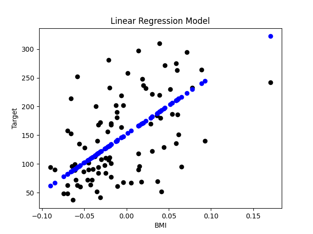
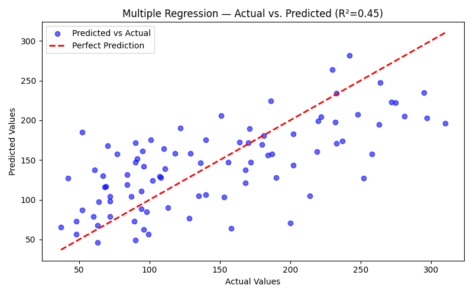
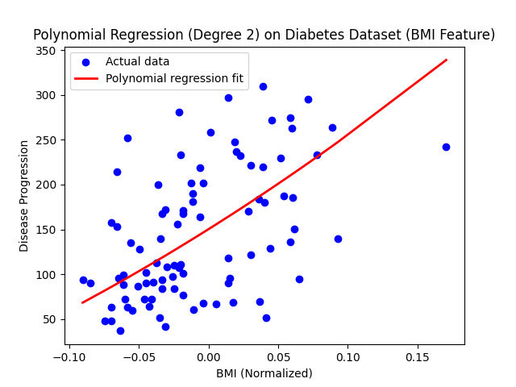
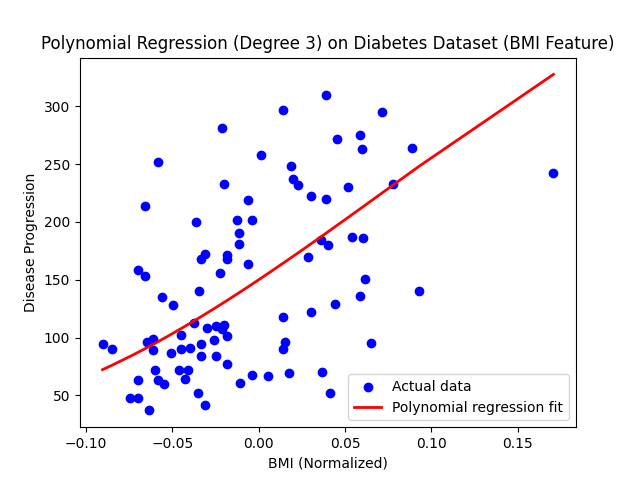
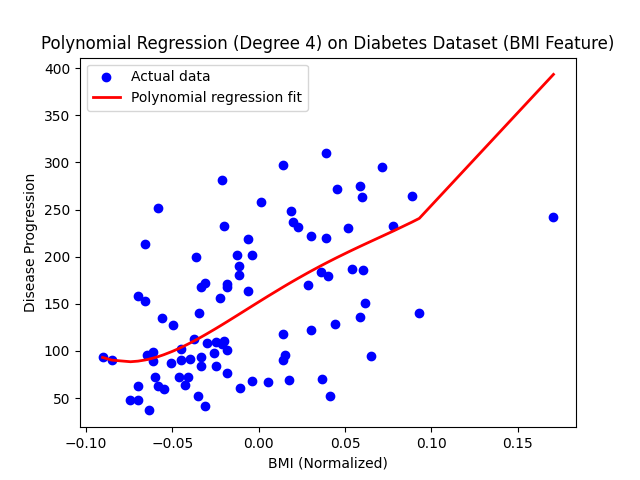
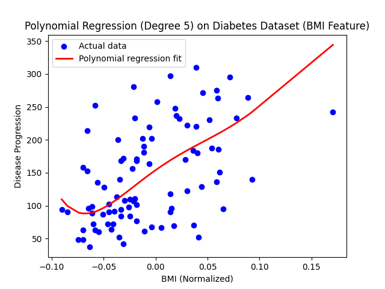
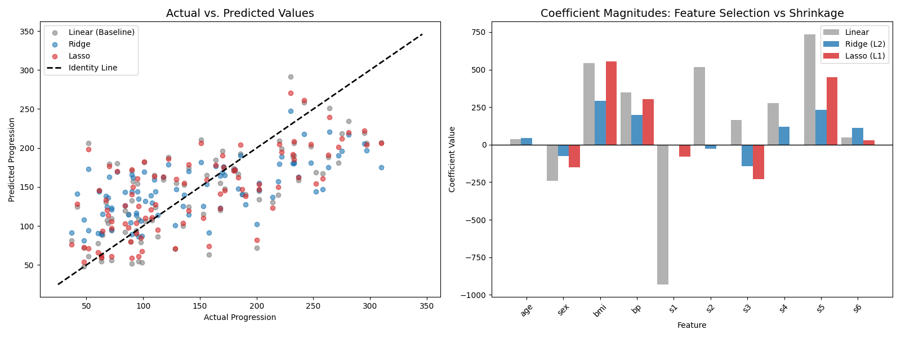

# MSCS-634 Lab 4: Regression Analysis with Regularization Techniques

### Laxmi Kanth Oruganti
### MSCS-634: Advanced Big Data and Data Mining

## Purpose

In this lab, I worked with the Scikit-learn Diabetes dataset to explore different regression models and understand how they perform when predicting disease progression. I started with a basic Simple Linear Regression, then moved to Multiple Regression, tried Polynomial Regression, and finally applied Ridge and Lasso regularization. The goal was to see how each model compares and learn when regularization actually helps.

## Dataset

The Diabetes dataset has **442 samples** with **10 features** like age, sex, BMI, blood pressure, and six blood serum measurements. All the features are already normalized. The target is a number that represents how much the disease progressed after one year.

## Results

### Step 1: Simple Linear Regression

I started by using just BMI as the single predictor since it had the highest correlation with the target (0.586). The model gave an R² of **0.233**, which means it only explains about 23% of the variance. It's a decent starting point but clearly not enough on its own.

The plot shows the actual vs predicted values — you can see there's a lot of spread, which makes sense given the low R².

### Step 2: Multiple Regression

Next, I looked at the correlation values and picked the four features most correlated with the target: **bmi, bp, s4, and s5**. Using these four features improved things quite a bit — R² went up to **0.453** and MAE dropped from 52.26 to 44.31.

The predicted vs actual plot looks tighter compared to the simple regression. The points are closer to the red dashed line (perfect prediction), though there are still some outliers.

### Step 3: Polynomial Regression

I tried polynomial regression on the BMI feature with degrees 2 through 5 to see if adding non-linear terms would help. Honestly, it didn't make much difference. The R² stayed around 0.23 for most degrees, and degree 4 actually got worse (R² = 0.20), which I think is a sign of overfitting.

| Degree | MAE | MSE | RMSE | R² |
|---|---|---|---|---|
| 2 | 52.38 | 4085.03 | 63.91 | 0.230 |
| 3 | 52.18 | 4064.44 | 63.75 | 0.230 |
| 4 | 52.38 | 4226.14 | 65.01 | 0.200 |
| 5 | 51.88 | 4085.85 | 63.92 | 0.230 |

Looking at the plots, the curves don't really change much between degrees. The relationship between BMI and disease progression seems to be mostly linear, so adding polynomial terms just adds complexity without any real benefit.

### Step 4: Ridge and Lasso Regression

Finally, I used all 10 features and compared standard Linear Regression with Ridge (alpha=1.0) and Lasso (alpha=0.1).

| Model | MAE | MSE | RMSE | R² |
|---|---|---|---|---|
| Linear Regression | 42.79 | 2900.19 | 53.85 | 0.453 |
| Ridge (alpha=1.0) | 46.14 | 3077.42 | 55.47 | 0.419 |
| Lasso (alpha=0.1) | 42.85 | 2798.19 | 52.90 | 0.472 |

The left plot shows actual vs predicted for all three models — they look similar but Lasso is slightly tighter. The right plot is really interesting because it shows how the coefficients differ. Lasso pushed some of the less useful feature coefficients down to zero, basically doing feature selection automatically. Ridge shrank the coefficients more evenly but didn't eliminate any.

Lasso ended up being the best model overall with the lowest MSE (2798.19) and highest R² (0.472).

## Overall Comparison

| Model | MAE | MSE | RMSE | R² |
|---|---|---|---|---|
| Simple Linear Regression (BMI) | 52.26 | 4061.83 | 63.73 | 0.233 |
| Multiple Regression (4 features) | 44.31 | 2900.29 | 53.85 | 0.453 |
| Polynomial Degree 2 (BMI) | 52.38 | 4085.03 | 63.91 | 0.230 |
| Polynomial Degree 3 (BMI) | 52.18 | 4064.44 | 63.75 | 0.230 |
| Polynomial Degree 4 (BMI) | 52.38 | 4226.14 | 65.01 | 0.200 |
| Polynomial Degree 5 (BMI) | 51.88 | 4085.85 | 63.92 | 0.230 |
| Linear Regression (All Features) | 42.79 | 2900.19 | 53.85 | 0.453 |
| Ridge Regression | 46.14 | 3077.42 | 55.47 | 0.419 |
| Lasso Regression | 42.85 | 2798.19 | 52.90 | 0.472 |

## Key Insights

### How Well Each Model Performed
- **Simple Linear Regression** with just BMI was the weakest (R² = 0.233). It only captures about 23% of what's going on, which tells me one feature alone isn't enough for this kind of prediction.
- **Multiple Regression** with four features (bmi, bp, s4, s5) was a big jump — R² nearly doubled to 0.453. Just picking the right features made a huge difference.
- **Polynomial Regression** didn't really improve anything. All degrees (2–5) stayed around R² = 0.23, basically the same as simple linear regression. The BMI-target relationship is mostly linear, so adding curves didn't help.
- **Lasso Regression** gave the best results overall (R² = 0.472, MSE = 2798.19). It beat even plain linear regression with all features.
- **Ridge Regression** actually performed a bit worse than the baseline (R² = 0.419). It shrank all the coefficients evenly, but for this dataset that wasn't the right approach.

### Which Models Handled Overfitting
- **Polynomial Degree 4** showed clear signs of overfitting — its R² dropped to 0.20, worse than a simple straight line. Higher-degree polynomials on a single feature just fit the noise in the training data.
- **Lasso** handled overfitting the best. By pushing irrelevant feature weights to zero, it kept the model simple and focused on what matters. This is basically automatic feature selection, and it worked really well here.
- **Ridge** helped with overfitting in theory by shrinking coefficients, but since it doesn't eliminate any features, it still carried the noise from less useful ones like age and sex.

## What I Learned

- Adding more relevant features helps a lot more than making a single feature more complex (multiple regression vs polynomial regression).
- Regularization isn't always better — Ridge actually hurt performance here, while Lasso improved it. The choice depends on whether your dataset has truly irrelevant features (use Lasso) or just noisy ones (use Ridge).
- Simpler models can be just as good or better. Lasso's ability to zero out features kept it lean and effective.
- Not every problem needs a complicated model. Understanding the data and picking the right features can matter more than the algorithm itself.
